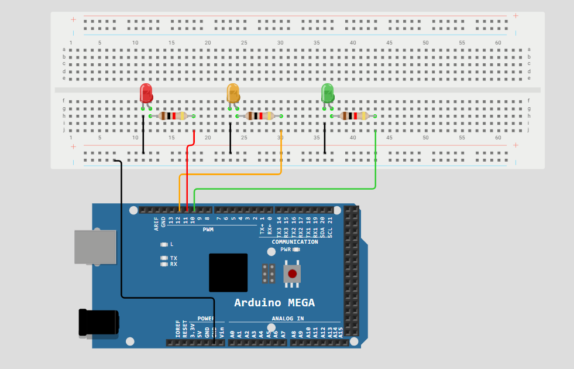
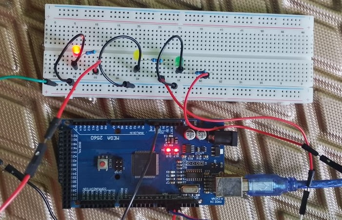

# Traffic Light Controller — Bare-Metal AVR C

A simple traffic light controller implemented in **bare-metal C** for the **ATmega2560**, using an AVR-GCC development toolchain.

This project is an introductory embedded systems exercise focused on moving from a simulated circuit to a physical microcontroller while establishing a basic embedded firmware development workflow.

---

## 1. Project Overview

The project simulates a basic traffic light using three LEDs:

* 🔴 Red
* 🟡 Yellow
* 🟢 Green

The LEDs are controlled by the ATmega2560 according to a predefined sequence.

The circuit was first tested in **WOKWI simulation** and is then reproduced on a physical breadboard using an **Arduino Mega 2560**.

The purpose of this project is to establish a foundation in:

* C programming for microcontrollers
* GPIO control
* AVR register-level programming
* Bit manipulation
* Basic software timing
* Firmware compilation
* Build automation with Make
* Microcontroller programming with `avrdude`
* Physical hardware testing

This is intentionally a simple project and represents an early step in my embedded systems journey.

---

## 2. Objectives

The project aims to:

* Write a simple embedded application in C.
* Control physical LEDs using the ATmega2560.
* Begin working directly with AVR GPIO registers.
* Understand how C code interacts with microcontroller hardware.
* Compile firmware using AVR-GCC.
* Use `avr-libc` and AVR-specific headers.
* Automate the build process using a Makefile.
* Program the microcontroller using `avrdude`.
* Reproduce a previously tested simulation on physical hardware.
* Establish a clean and reproducible embedded development workflow using VS Code.

---

## 3. System Behavior

The traffic light operates through a predefined sequence:

```text
RED
 ↓
YELLOW
 ↓
GREEN
 ↓
RED
 ↓
...
```

Only one traffic-light LED is intended to be active at a time.

### State Table

| State  | Red | Yellow | Green |
| ------ | --- | ------ | ----- |
| RED    | ON  | OFF    | OFF   |
| YELLOW | OFF | OFF    | ON    |
| GREEN  | OFF | ON     | OFF   |

The sequence repeats continuously.

> Timing is implemented using a basic software delay for this introductory project. Hardware timers and interrupts are outside the scope of this version.

---

## 4. Hardware

### Microcontroller

**Arduino Mega 2560 / ATmega2560**

The Arduino Mega 2560 is used as the physical development platform. The firmware is written for the **ATmega2560 microcontroller** and does not rely on the Arduino programming framework or Arduino libraries.

### Components

| Component                  |    Quantity | Purpose                  |
| -------------------------- | ----------: | ------------------------ |
| Arduino Mega 2560          |           1 | Microcontroller platform |
| Red LED                    |           1 | Traffic signal           |
| Yellow LED                 |           1 | Traffic signal           |
| Green LED                  |           1 | Traffic signal           |
| Current-limiting resistors |           3 | LED protection           |
| Breadboard                 |           1 | Circuit prototyping      |
| Jumper wires               | As required | Electrical connections   |

---

## 5. Hardware Pin Mapping

The project uses the following Arduino Mega digital pins:

| Function   | Arduino Pin | ATmega2560 Port |
| ---------- | ----------- | --------------- |
| Red LED    | D11         | PB5            |
| Yellow LED | D12         | PB6             |
| Green LED  | D10         | PB4             |

The Arduino Mega uses board-level pin labels such as `D11`, while the ATmega2560 datasheet identifies the corresponding microcontroller pins using AVR port notation such as `PB5`.

This distinction is important when writing bare-metal code because the firmware interacts with the **ATmega2560 registers and ports**, rather than the Arduino pin abstraction.

A custom pin-mapping reference is included in the `docs/` directory to make this relationship easier to understand.

---

## 6. Development Environment

### Editor

**Visual Studio Code**

### Programming Language

**C**

### Target

**ATmega2560**

### Toolchain

* **AVR-GCC** — C compiler for AVR microcontrollers
* **avr-libc** — AVR-specific C library and headers
* **GNU Make** — Build automation
* **avrdude** — Firmware programming/flashing

The project uses these tools directly rather than relying on the Arduino IDE or Arduino libraries.

---

## 7. Development Workflow

The development workflow is:

```text
C Source Code
      ↓
    AVR-GCC
      ↓
Compiled Firmware
      ↓
     Make
      ↓
   HEX File
      ↓
   avrdude
      ↓
 ATmega2560
      ↓
 Physical LEDs
```

The basic development cycle is:

```text
Write → Build → Flash → Test → Debug → Repeat
```

---

## 8. Project Structure

```text
traffic-light-controller/
│
├── src/
│   └── main.c
│
├── docs/
│   ├── ATmega2560_Datasheet.pdf
│   └── ATmega2560_Pin_Mapping.pdf
│
├── Makefile
├── README.md
└── .gitignore
```

### `src/`

Contains the embedded C source code.

### `docs/`

Contains technical reference material used during development:

* `ATmega2560_Datasheet.pdf` — Microcontroller datasheet.
* `ATmega2560_Pin_Mapping.pdf` — Custom reference mapping Arduino Mega pin labels to the corresponding ATmega2560 port names.

### `Makefile`

Contains the build and flashing commands used to compile and program the firmware.

### `.gitignore`

Prevents generated build files and other unnecessary files from being committed to the repository.

---

## 9. Software Design

The application follows a simple sequential control structure.

At startup:

1. Configure the required GPIO pins as outputs.
2. Set the initial traffic-light state.
3. Activate the appropriate LED.
4. Wait for the required delay.
5. Move to the next state.
6. Repeat continuously.

Conceptually:

```text
Initialize GPIO
      ↓
   RED state
      ↓
    Delay
      ↓
  GREEN state
      ↓
    Delay
      ↓
 YELLOW state
      ↓
    Delay
      ↓
   Repeat
```

---

## 10. Bare-Metal Approach

This project intentionally avoids the Arduino API.

Instead of using high-level functions such as:

```c
pinMode();
digitalWrite();
delay();
```

the project uses AVR-specific definitions and registers to interact directly with the ATmega2560 hardware.

The basic relationship being explored is:

```text
C Code
   ↓
AVR Registers
   ↓
GPIO Hardware
   ↓
Physical LED
```

This provides an early introduction to how embedded software directly controls microcontroller hardware.

---

## 11. Building the Project

The project uses **GNU Make** to simplify and standardize the build process.

From the project directory:

```bash
make
```

This compiles the source code and generates the required firmware output.

To remove generated build files:

```bash
make clean
```

The exact compiler, MCU, optimization, output, and other build settings are defined in the `Makefile`.

---

## 12. Flashing the ATmega2560

After successfully building the firmware, `avrdude` is used to program the ATmega2560.

The flashing configuration depends on the programmer/bootloader configuration, COM port, and communication settings being used.

The project exposes the flashing process through the Makefile:

```bash
make flash
```

This keeps the programming process consistent instead of requiring the complete `avrdude` command to be entered manually each time.

---

## 13. Testing

Testing is performed in two stages.

### 13.1 Simulation

The traffic-light circuit was first implemented and tested in **WOKWI**.

The simulation was used to verify the basic logic and expected LED sequence before moving to physical hardware.



### 13.2 Physical Hardware

The same concept is reproduced using:s

* Arduino Mega 2560
* ATmega2560
* Three LEDs
* Current-limiting resistors
* Breadboard



The physical implementation verifies that the firmware correctly controls the selected GPIO pins.

### Expected Result

The LEDs should continuously follow:

```text
🔴 → 🟢 → 🟡 → 🔴 → ...
```

with the programmed delay between states.

---

## 14. Current Scope

This version intentionally focuses on fundamental concepts.

### Included

* AVR-GCC
* C
* avr-libc
* GPIO
* AVR registers
* Bit manipulation
* Basic software delays
* Makefiles
* Firmware compilation
* `avrdude`
* Physical hardware testing

### Not Yet Covered

The following are intentionally outside the scope of this first project:

* Hardware timers
* Timer interrupts
* External interrupts
* UART communication
* ADC
* PWM
* SPI
* I²C
* RTOS
* Advanced communication protocols
* Complex state-machine architectures

These concepts will be introduced progressively in later embedded systems projects.

---

## 15. Challenges and Development Notes

This section records practical problems encountered during development and how they were resolved.

One of the initial challenges was understanding the relationship between the **Arduino Mega pin labels** and the **ATmega2560 datasheet pin/port naming convention**.

For example:

```text
Arduino Mega D10 → ATmega2560 PB4
Arduino Mega D11 → ATmega2560 PB5
Arduino Mega D12 → ATmega2560 PB6
```

The custom reference document in `docs/ATmega2560_Pin_Mapping.pdf` was created to make this relationship easier to identify during development.

Other challenges encountered during development may include:

* GPIO configuration errors
* Incorrect LED polarity
* Incorrect resistor connections
* Incorrect register settings
* Compilation errors
* Makefile errors
* Incorrect MCU configuration
* `avrdude` communication problems
* Incorrect COM port selection

---

## 16. What I Learned

Key concepts introduced by this project include:

* Structure of a basic embedded C application.
* ATmega2560 GPIO configuration.
* AVR register-level programming.
* Bitwise operations.
* Basic software timing.
* How AVR-GCC compiles embedded C.
* How a Makefile organizes the build process.
* How firmware is transferred to a microcontroller.
* The difference between simulation and physical hardware.
* The relationship between software and electrical hardware.
* The importance of understanding microcontroller documentation and pin mappings.

---

## 17. Future Improvements

Possible future versions will introduce concepts progressively.

### Version 2

* Replace software delays with a hardware timer.
* Introduce timer-based timing.

### Version 3

* Introduce interrupts.
* Separate traffic-light logic from hardware configuration.

### Version 4

* Add a pedestrian button.
* Introduce digital input handling.

### Future Embedded Development

The concepts introduced by this project provide a starting point for progressively more advanced embedded systems work:

```text
GPIO
 ↓
Timers
 ↓
Interrupts
 ↓
UART
 ↓
ADC
 ↓
PWM
 ↓
SPI / I²C
 ↓
Sensors & Actuators
 ↓
Communication Protocols
 ↓
RTOS
 ↓
More Complex Embedded Systems
```

---

## 18. References

The following resources are included or used as references for the project:

* ATmega2560 Datasheet
* Custom ATmega2560 Pin-Mapping Reference
* AVR-GCC Documentation
* avr-libc Documentation
* GNU Make Documentation
* avrdude Documentation

Additional project-specific references are located in the `docs/` directory.

---

## 19. Project Status

**Status:** In Development

**Project Type:** Introductory Embedded Systems

**Architecture:** AVR 8-bit

**Target MCU:** ATmega2560

**Development Board:** Arduino Mega 2560

**Language:** C

**Programming Approach:** Bare-Metal

**Build System:** GNU Make

**Compiler:** AVR-GCC

**C Library:** avr-libc

**Programmer:** avrdude

**Development Environment:** Visual Studio Code

---

## 20. Author

**Kennedy Kabwe**

Electrical & Electronics Engineering

> This project represents an early step in my embedded systems journey, focusing on understanding the fundamentals before progressing toward more advanced microcontroller peripherals, communication interfaces, and embedded architectures.
